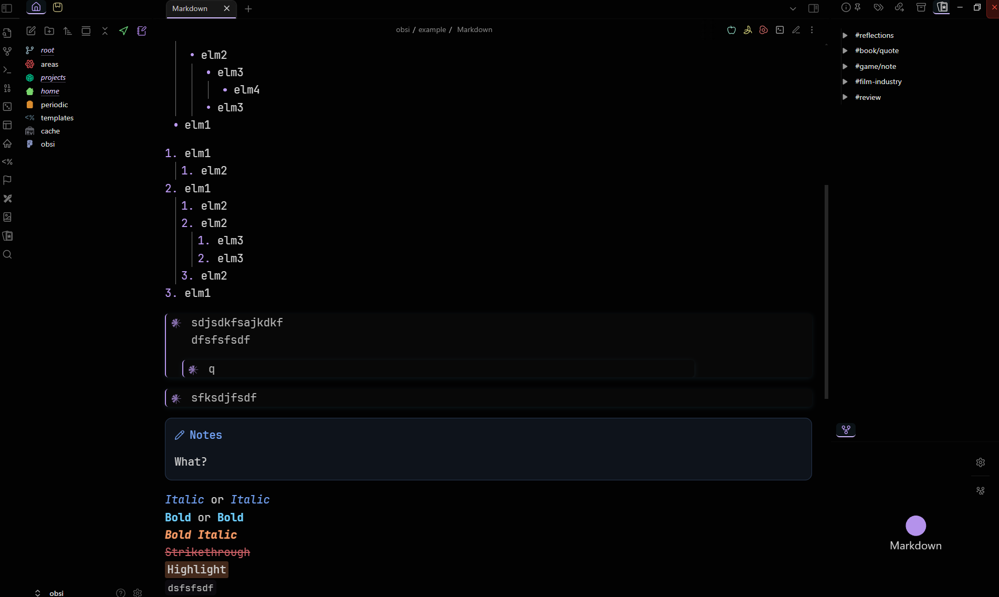
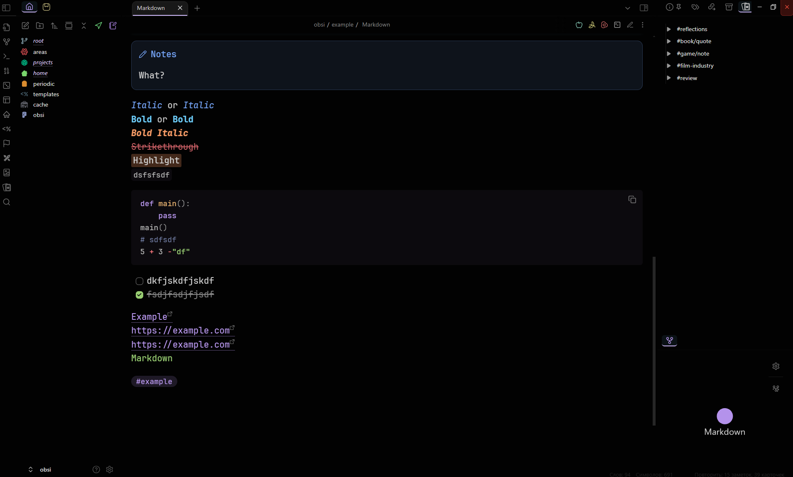
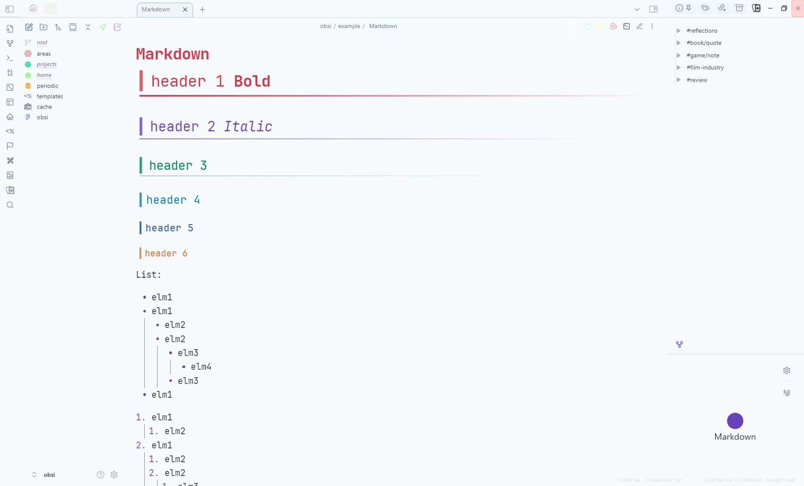
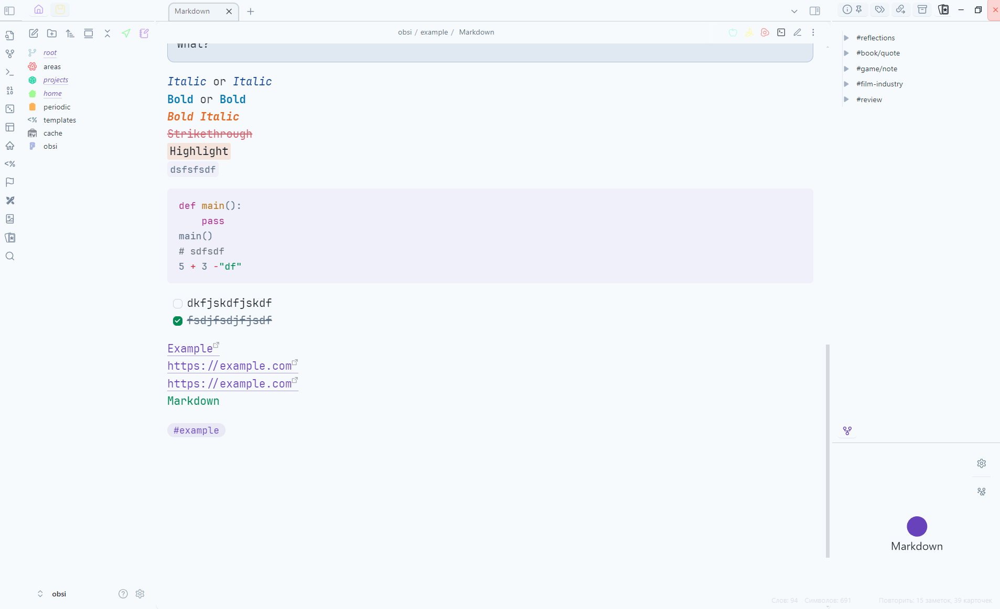

# Robsi Theme

A modern theme for Obsidian with beautiful blur effects, purple accents, and a clean, minimalist aesthetic.

## ✨ Features

-   🎨 **Material Design 3**: A modern and clean design.
-   💧 **Blur Effects**: Beautiful "frost effect" on sidebars and modals.
-   💜 **Accent Colors**: An elegant purple color scheme for both light and dark modes, plus Rose Pine style accents.
-   📱 **Responsive Design**: Optimized for desktop, tablet, and mobile devices.
-   ⚡ **Performance Optimized**: Smooth animations with support for reduced motion.
-   📝 **Enhanced Lists**: Beautiful multi-level lists with shaped markers.
-   🎯 **Compact UI**: Optimized use of space.
-   🔧 **Customization**: Extensive customization options via the Style Settings plugin.

## 🚀 Installation

1.  Download `manifest.json` and `theme.css` from the [latest release](https://github.com/Riffaells/Robsi/releases).
2.  Place both files in the `.obsidian/themes/Robsi/` folder in your vault (create the `Robsi` folder if it doesn't exist).
3.  Enable the theme in **Settings → Appearance → Themes**.

## 🛠️ For Developers

This project uses a modular structure for easy development.

### Building the Theme

```bash
# Install dependencies
pip install -r requirements.txt

# Build the theme
python auto_build.py
```

<details>
<summary>Project Structure</summary>

```
styles/
├── variables.css          # Global variables
├── base.css               # Base styles
├── components/            # UI component styles
├── utilities/             # Utility classes
├── themes/                # Variables for light and dark themes
├── plugins/               # Plugin-specific styles
└── settings.css           # Style Settings configuration
```
</details>

## 🖼️ Gallery








## 🤝 Contributing

If you have suggestions for improvement or find a bug, please create an [issue](https://github.com/Riffaells/Robsi/issues) or pull request.

## 📄 License

MIT License
