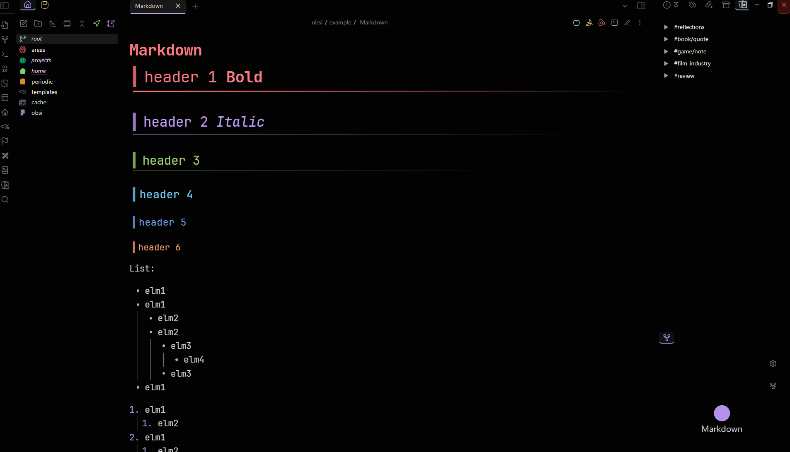
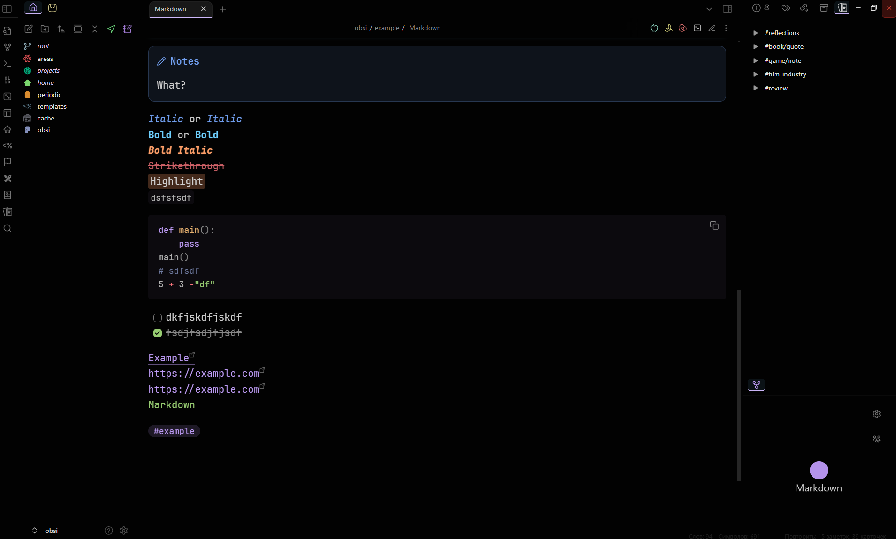
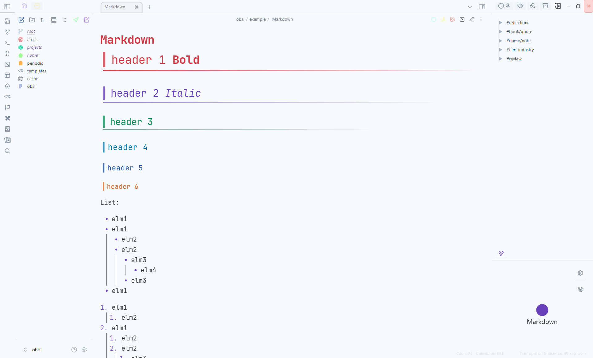
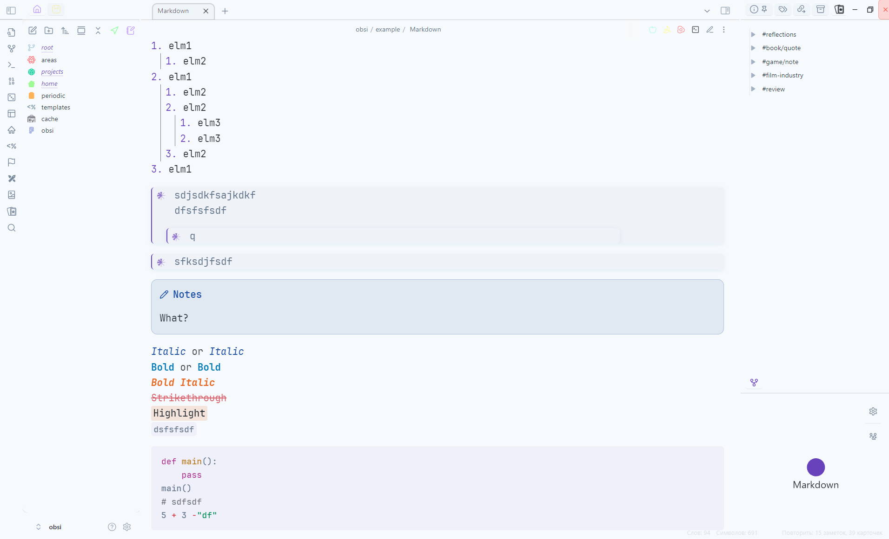
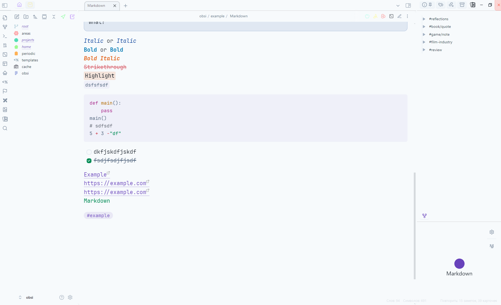

# Robsi Theme

Современная тема для Obsidian с красивыми эффектами размытия, фиолетовыми акцентами и чистым, минималистичным интерфейсом.

## ✨ Особенности

-   🎨 **Material Design 3**: Современный и чистый дизайн.
-   💧 **Эффекты размытия**: Красивый "фрост-эффект" на боковых панелях и в модальных окнах.
-   💜 **Акцентные цвета**: Элегантная фиолетовая цветовая схема для светлого и темного режимов, а также акценты в стиле Rose Pine.
-   📱 **Адаптивный дизайн**: Оптимизировано для ПК, планшетов и мобильных устройств.
-   ⚡ **Оптимизация производительности**: Плавные анимации и поддержка режима "уменьшенного движения".
-   📝 **Улучшенные списки**: Красивые многоуровневые списки с маркерами разных форм.
-   🎯 **Компактный интерфейс**: Оптимизированное использование пространства.
-   🔧 **Кастомизация**: Широкие возможности настройки через плагин Style Settings.

## 🚀 Установка

1.  Скачайте `manifest.json` и `theme.css` из [последнего релиза](https://github.com/Riffaells/Robsi/releases).
2.  Поместите оба файла в папку `.obsidian/themes/Robsi/` в вашем хранилище (создайте папку `Robsi`, если ее нет).
3.  Включите тему в **Настройки → Внешний вид → Темы**.

## 🛠️ Для разработчиков

Этот проект использует модульную структуру для удобства разработки.

### Сборка темы

```bash
# Установить зависимости
pip install -r requirements.txt

# Собрать тему
python auto_build.py
```

<details>
<summary>Структура проекта</summary>

```
styles/
├── variables.css          # Глобальные переменные
├── base.css               # Базовые стили
├── components/            # Стили для компонентов интерфейса
├── utilities/             # Утилиты
├── themes/                # Переменные для светлой и темной тем
├── plugins/               # Стили для плагинов
└── settings.css           # Настройки для Style Settings
```
</details>

## 🖼️ Галерея








## 🤝 Вклад

Если у вас есть предложения по улучшению или вы нашли ошибку, создайте [issue](https://github.com/Riffaells/Robsi/issues) или pull request.

## 📄 Лицензия

MIT License
